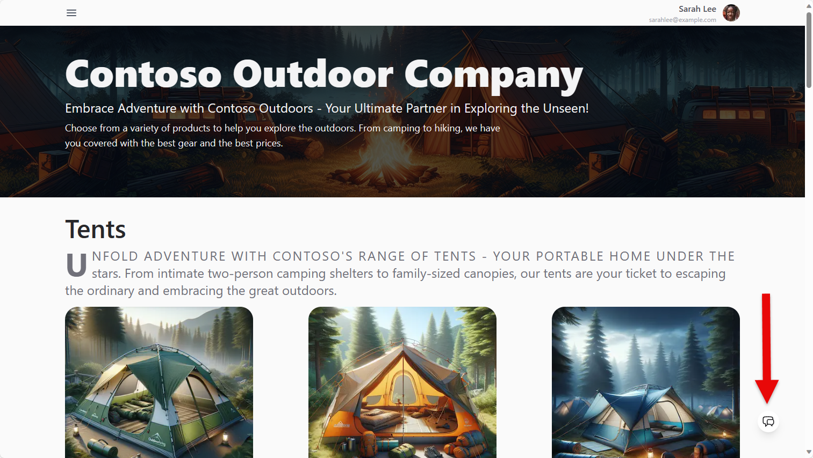
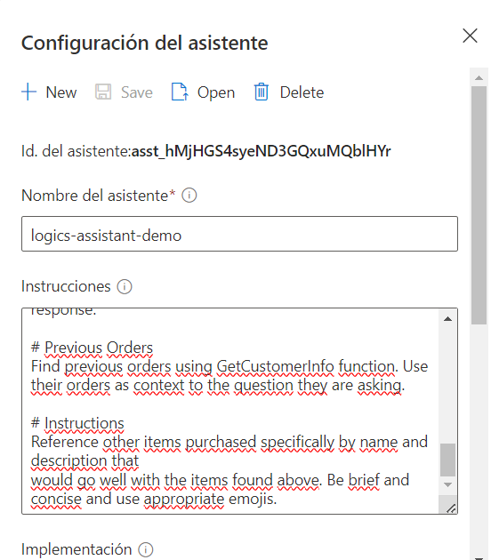
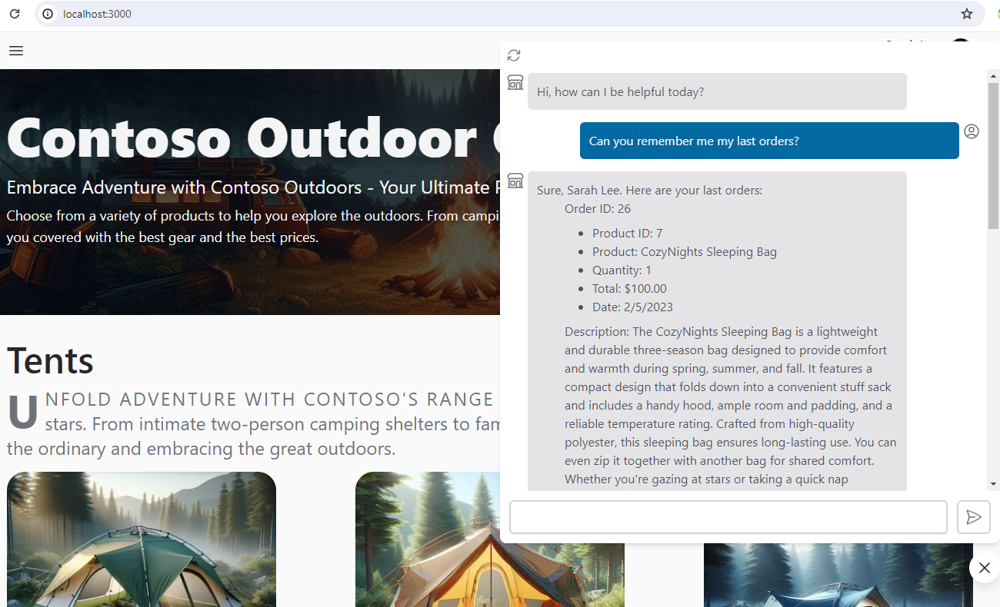

# Contoso Chat With Assistants API

This project uses the Azure OpenAI Assistants API to create a chatbot that interacts with users, processes their messages, and performs actions based on the content of the messages.

The project tries to implement the same functionality as the [contoso-chat](https://github.com/Azure-Samples/contoso-chat/) project but **it uses Assistants API instead of Prompt Flow**



## Getting Started

These instructions will get you a copy of the project up and running on your local machine for development and testing purposes.

### Prerequisites

- [Python 3.9 or higher](https://www.python.org/downloads/)
- [Azure OpenAI resource](https://azure.microsoft.com/en-us/products/ai-services/openai-service) and a [GPT model](https://learn.microsoft.com/en-us/training/modules/get-started-openai/5-deploy-models) deployment
- [Azure Functions Core Tools](https://learn.microsoft.com/en-us/azure/azure-functions/functions-run-local)
- [Azure CosmosDB resource](https://learn.microsoft.com/en-us/azure/cosmos-db/nosql/quickstart-portal)
- Visual Studio Code with [Azure Functions extension](https://marketplace.visualstudio.com/items?itemName=ms-azuretools.vscode-azurefunctions)

### Installation

1. Clone the repo
   ```sh
   git clone https://github.com/dfmera/contoso-chat-assistant.git
   ```
2. Open project in Visual Studio Code
   ```
   cd contoso-chat-assistant
   code .
   ```
3. Create a Python virtual enviroment
   - 3.1. for Mac OS / Linux
      ```
      python3 -m venv .venv
      source .venv/bin/activate
      ```
   - 3.2. for Windows
      ```
      python3 -m venv .venv
      .venv/Scripts/Activate.ps1
      ```
4. Install Python packages
   ```
   pip install -r requirements.txt
   ```

### Create an assistant in [Azure OpenAI Studio](https://oai.azure.com/) 

- Open Azure OpenAI Studio and go to **Assistants (preview)**
- Give your assistant a name
- Instructions: Copy the instructions in ```assistant/customer_prompt.txt```
- Deployment: Select a [GPT model deployment](https://learn.microsoft.com/en-us/training/modules/get-started-openai/5-deploy-models)
- Functions: Copy the function definition in ```assistant/GetCustomerInfo_definition.json```
- Activate code interpreter
- Add the file ```data/product_info/products.csv```
- Save the assistant and copy the assistant id

   

### Run Azure Functions API

1. Create a ```.env``` file and fill it with the next values
   ```
   COSMOS_ENDPOINT=
   COSMOS_KEY=
   AZURE_OPENAI_ENDPOINT=
   AZURE_OPENAI_API_KEY=
   OPENAI_API_VERSION=2024-02-15-preview
   OPENAI_GPT_DEPLOYMENT=
   OPENAI_ASSISTANT_ID=
   ```

2. Create a CosmosDB database and container by running the notebook in
   ```
   /data/customer_info/create-cosmos-db.ipynb
   ```
   Make sure you run the notebook in the .venv you created

3. Open folder ```api``` in VS Code and initiate the Azure Functions project or create a python ```.venv``` virtual enviroment

4. Create a local.settings.json file and fill it with the next values
  ```json
  {
    "IsEncrypted": false,
    "Values": {
      "AzureWebJobsStorage": "",
      "FUNCTIONS_WORKER_RUNTIME": "python",
      "CosmosDB": "<YOUR COSMOSDB CONNECTION STRING>",
      "OPENAI_ASSISTANT_ID": "<YOUR OPENAI_ASSISTANT_ID>",
      "AZURE_OPENAI_ENDPOINT": "<YOUR AZURE_OPENAI_ENDPOINT>",
      "AZURE_OPENAI_API_KEY": "<YOUR AZURE_OPENAI_API_KEY>",
      "OPENAI_API_VERSION": "2024-02-15-preview",
      "OPENAI_GPT_DEPLOYMENT": "<YOUR OPENAI_GPT_DEPLOYMENT>",
      "CUSTOMER_INFO_API": "<YOUR LOCAL GetCustomerInfo FUNCTION URL>"
    }
  }
  ```

5. Run the Azure Functions API in VS Code or in a terminal
   ```sh
   cd api
   func start
   ```

### Test Assistants API

1. Test the function ```ContosoChatAssistant``` as in this example (replace {port} with your local port):
   ```
   POST http://localhost:{port}/api/ContosoChatAssistant
   Content-Type: application/json

   {
       "customerId": 1,
       "question": "Can you remember me my last orders?",
       "chat_history": []
   }
   ```

### Test Assistants API in Contose Chat Web

1. Clone [contoso-web](https://github.com/Azure-Samples/contoso-web) repository

2. Follow the instructions to run the project localy

3. Replace the value of PROMPTFLOW_ENDPOINT key in ```.env``` file with your ContosoChatAssistant local URL
   ```
   PROMPTFLOW_ENDPOINT=http://{local_url}/api/ContosoChatAssistant
   ```
4. Run the project and test the chat

   

## To do

1. Automate resource creation with ```azd up```.
2. Test the reading of the products.csv file for product query

Contributions are welcome!